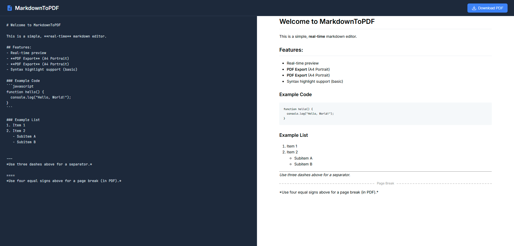

# Markdown to PDF Converter

A simple, lightweight, and offline-capable web application that converts Markdown text to PDF in real-time. Built with Vanilla JavaScript, it offers an instant preview and high-quality PDF export functionality.

🔗 **Repository:** [https://github.com/alperdereli/md-to-pdf](https://github.com/alperdereli/md-to-pdf)

🔗 **Live Test:** [https://alperdereli.github.io/md-to-pdf/](https://alperdereli.github.io/md-to-pdf/)




## 🚀 Features

- **Real-time Conversion:** Type Markdown on the left, see the HTML preview on the right instantly.
- **PDF Export:** Download the rendered HTML as a properly formatted A4 PDF document.
- **Dark Mode UI:** Designed with a sleek, dark-themed interface for comfortable typing.
- **Syntax Highlighting:** Basic code block support.
- **Custom Page Breaks:** Control your PDF layout with custom page break markers.
- **Zero Dependencies:** Runs entirely in the browser using CDN libraries (no backend required).

## 🛠️ Technologies Used

- **HTML5 & CSS3** (Flexbox, CSS Variables)
- **Vanilla JavaScript** (ES6+)
- **[Marked.js](https://github.com/markedjs/marked)** - For parsing Markdown.
- **[html2pdf.js](https://github.com/eKoopmans/html2pdf.js)** - For generating PDFs from HTML.
- **Google Fonts** (Inter, JetBrains Mono)

## 📦 Installation & Usage

1. **Clone the repository:**
   ```bash
   git clone https://github.com/alperdereli/md-to-pdf.git
   ```
2. **Open the project:**
   Navigate to the project folder and simply open `index.html` in your web browser. No server setup is required.

## 📝 Markdown Syntax Guide

### Basic Syntax
Standard Markdown syntax is supported (Headers, Lists, Bold, Italic, Code Blocks, etc.).

### Page Breaks
To force a new page in the PDF export, use four equal signs on a new line:

```markdown
Some content on page 1...

====

Some content on page 2...
```

*Note: The standard `---` is used for a visual separator line (`<hr>`), while `====` is reserved for actual PDF page breaks.*

## 📄 License

This project is open-source and available under the [MIT License](LICENSE).

---
Developed by [Alper Dereli](https://github.com/alperdereli)
